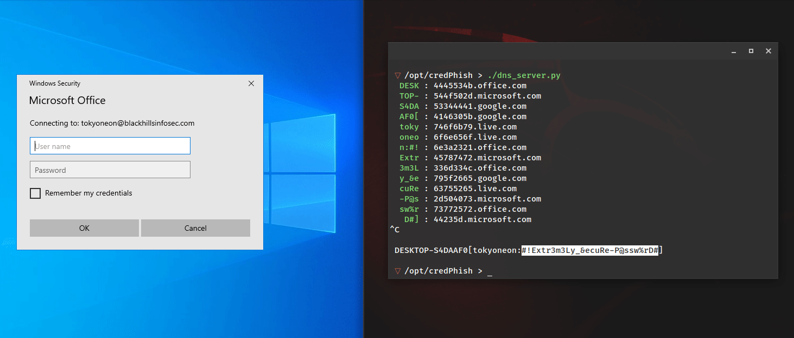

CredPhish is a PowerShell script designed to invoke credential prompts and exfiltrate passwords. It relies on [CredentialPicker](https://docs.microsoft.com/en-us/uwp/api/windows.security.credentials.ui.credentialpicker?view=winrt-19041) to collect user passwords, [Resolve-DnsName](https://docs.microsoft.com/en-us/powershell/module/dnsclient/resolve-dnsname) for DNS exfiltration, and Windows Defender's [ConfigSecurityPolicy.exe](https://lolbas-project.github.io/lolbas/Binaries/ConfigSecurityPolicy/) to perform arbitrary GET requests.

For a walkthrough, see the [Black Hills Infosec publication](https://www.blackhillsinfosec.com/how-to-phish-for-user-passwords-with-powershell/).
